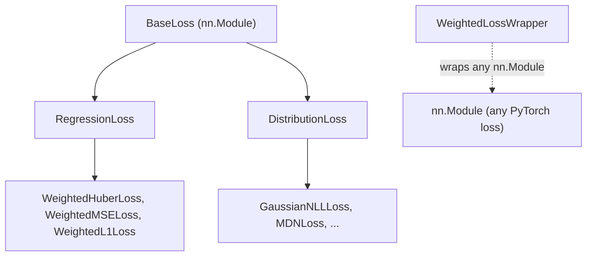

# Base Loss Classes

> ← [Loss Functions](index.md) | [Gaussian](gaussian.md) →

The foundation of all torchregress loss functions — providing **unified masking**, **sample weighting**, and **consistent reduction** semantics.

---

## Class Hierarchy



| Base Class | Purpose | Model Output |
|:-----------|:--------|:-------------|
| [`RegressionLoss`](../api/losses.md) | Point-prediction losses | $\hat{y}$ |
| [`DistributionLoss`](../api/losses.md) | Distributional losses (NLL) | $(\mu, \log\sigma^2)$ or distribution params |
| [`WeightedLossWrapper`](../api/losses.md) | Adapts any PyTorch loss | Same as wrapped loss |

---

## BaseLoss

Root class extending `nn.Module` (see [BaseLoss API](../api/losses.md)). All subclasses inherit:

- `reduction`: `"mean"` (default), `"sum"`, or `"none"`
- `_reduce(loss, mask, weights)`: applies reduction with masking and weighting

All reductions follow one **unified zero-fill policy**. Let $\ell_i$ be the per-sample (elementwise) loss, $m_i \in \{0,1\}$ the validity mask, and $w_i \ge 0$ the sample weights. With a combined influence factor $c_i = m_i\,w_i$ an element influences the loss if and only if $c_i > 0$; masked-out positions contribute **exactly zero** in every mode:

$$
\mathcal{L}_{\text{sum}} = \sum_i c_i\, \ell_i,
\qquad
\mathcal{L}_{\text{mean}} = \frac{\sum_i c_i\, \ell_i}{\sum_i c_i},
\qquad
\mathcal{L}_{\text{none}} = \big[c_i\, \ell_i\big]_i
$$

so `'mean'` is the **weighted mean** over valid samples (dividing by the number of unmasked elements when no weights are given, by the sum of weights otherwise) — never divided by the full batch size. A mask with more dims than the loss collapses with `all` over the trailing dims (a partially masked row drops); weights broadcast and average over trailing dims.

```python
class CustomLoss(BaseLoss):
    def forward(self, y_pred, y_true, mask=None, weights=None, **kwargs):
        loss = (y_pred - y_true) ** 2
        return self._reduce(loss, mask, weights)
```

---

## RegressionLoss

For losses that operate on **point predictions** $\hat{y}$ (see [RegressionLoss API](../api/losses.md)):

```python
from torchregress.losses import WeightedMSELoss, WeightedL1Loss, WeightedHuberLoss

loss_fn = WeightedMSELoss()
loss = loss_fn(y_pred, y_true, mask=valid_mask, weights=sample_weights)
```

All `RegressionLoss` subclasses accept:

| Argument | Type | Description |
|:---------|:-----|:------------|
| `y_pred` | `Tensor` | Model predictions |
| `y_true` / `target` | `Tensor` | Ground truth |
| `mask` | `Tensor` (bool) | Valid-sample mask |
| `weights` | `Tensor` | Per-sample importance weights |

---

## DistributionLoss

For losses that model **full probability distributions** (see [DistributionLoss API](../api/losses.md)):

```python
from torchregress.losses import GaussianNLLLoss

loss_fn = GaussianNLLLoss()

# Model outputs (mean, log_var) — either as tuple or concatenated
mean = torch.randn(64, 1)
log_var = torch.randn(64, 1)
loss = loss_fn((mean, log_var), y_true)
```

> For the full API contract, see [GaussianNLLLoss API](../api/losses.md).

Key methods:

| Method | Description |
|:-------|:------------|
| `_extract_distribution_parameters(y_pred)` | Split model output into distribution params |
| `_calculate_nll(y_pred, y_true, mask)` | Compute negative log-likelihood |

---

## WeightedLossWrapper

Adapts **any PyTorch loss** to the torchregress interface (mask + weights support):

```python
from torchregress.losses import WeightedLossWrapper
import torch.nn as nn

# Wrap standard PyTorch loss
wrapped = WeightedLossWrapper(nn.MSELoss)
loss = wrapped(y_pred, y_true, mask=mask, weights=weights)
```

### Pre-Defined Weighted Losses

| torchregress | Wraps |
|:-------------|:------|
| `WeightedMSELoss` | `nn.MSELoss` |
| `WeightedL1Loss` | `nn.L1Loss` |
| `WeightedHuberLoss` | `nn.HuberLoss` |
| `GaussianNLLLoss` | `nn.GaussianNLLLoss` |
| `WeightedCrossEntropyLoss` | `nn.CrossEntropyLoss` |
| `WeightedNLLLoss` | `nn.NLLLoss` |

---

## Implementing Custom Losses

```python
import torch
from torchregress.losses.base import RegressionLoss

class AsymmetricLoss(RegressionLoss):
    """Penalise under-prediction more than over-prediction."""

    def __init__(self, alpha=0.7, reduction="mean"):
        super().__init__(reduction=reduction)
        self.alpha = alpha

    def forward(self, y_pred, y_true, mask=None, weights=None, **kwargs):
        error = y_true - y_pred
        loss = torch.where(
            error > 0,
            self.alpha * error ** 2,        # under-prediction
            (1 - self.alpha) * error ** 2,   # over-prediction
        )
        return self._reduce(loss, mask, weights)
```

!!! tip "Best practices"
    1. Inherit from `RegressionLoss` (point) or `DistributionLoss` (distributional)
    2. Always call `self._reduce(loss, mask, weights)` — don't manually reduce
    3. Accept `**kwargs` in `forward` for compatibility with the loss registry
    4. Document the math in docstrings

---

## Limitations

1. **Weight semantics**: The `weights` parameter is NOT the same as `mask`. `mask` excludes samples entirely (binary). `weights` scales the contribution of valid samples. Both can be used together but have different semantics: `mask=False` means "this sample should not contribute to the loss at all"; `weight=0.0` on a masked-in sample means "this is a valid sample but contributes nothing."
2. **Reduction behaviour**: `reduction="none"` returns per-sample losses **before** masking. Apply `mask` and `weights` manually if you need per-sample values with masking.
3. **Custom loss contract**: If you implement a custom loss inheriting from `RegressionLoss` or `DistributionLoss`, you must call `self._reduce()` or `self._reduce_with_mask()` — manual reduction will bypass the `mask` and `weights` contract.

## Recommendations

- **Start from `RegressionLoss`** for point-prediction losses (MSE, MAE, Huber variants). Start from `DistributionLoss` for NLL-based losses.
- **Always call `self._reduce()`**: Do not manually compute `loss.mean()` — use the base class reduction to ensure mask and weight support.
- **Accept `**kwargs`** in `forward()` for forward-compatibility with the loss registry and factory functions.
- **Document the optimisation objective**: Include the mathematical formula (LaTeX) in the docstring. See existing losses for examples.

## References

| # | Reference |
|:-:|:----------|
| 1 | Goodfellow, I., Bengio, Y. & Courville, A. (2016). *Deep Learning*. MIT Press. |
| 2 | Kingma, D. P. & Ba, J. (2015). Adam: A Method for Stochastic Optimization. *ICLR*. |
| 3 | Gneiting, T. & Raftery, A. E. (2007). Strictly Proper Scoring Rules, Prediction, and Estimation. *JASA*, 102(477), 359–378. |

## Next steps

- [Loss Functions index](index.md) — every loss family with formulas and use cases
- [Losses API reference](../api/losses.md) — complete symbol table with signatures
- [Method Selection Matrix](../guide/method-selection.md) — task-first guidance
