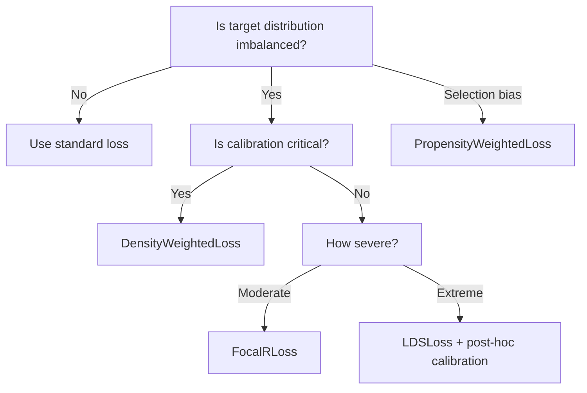

# Imbalanced Regression

> ← [Error-in-Variables](eiv.md) | [Noisy Labels](noisy_labels.md) →

Imbalanced regression addresses problems where the target distribution is **highly non-uniform** — some regions (e.g., extreme values) are severely underrepresented.  Standard MSE optimises average performance, causing the model to ignore rare-but-important regions.

---

## The Problem

$$\mathcal{L}_{\text{standard}} = \frac{1}{N}\sum_{i=1}^N \ell(f(x_i), y_i) \quad \xrightarrow{\text{reweight}} \quad \mathcal{L}_{\text{balanced}} = \frac{1}{N}\sum_{i=1}^N w(y_i)\;\ell(f(x_i), y_i)$$

!!! warning "Calibration risk"
    Reweighting changes the effective training distribution.  **DensityWeightedLoss** preserves calibration; **LDSLoss** may break it.  Always validate calibration after training.

---

## Available Losses

| Loss | Method | Calibration | Pre-fitting | API |
|:-----|:-------|:-----------:|:-----------:|:----|
| `BalancedMSELoss` | Inverse **bin** frequency (fixed edges) | ⚠️ Check | `fit(y)` | [Losses API](../api/losses.md) (imbalanced) |
| `BinReweightedMSELoss` | Inverse bin frequency + count smoothing | ⚠️ Check | `fit(y)` | [Losses API](../api/losses.md) (imbalanced) |
| `DensityWeightedLoss` | Inverse kernel-density weights | ✅ Safe | `fit_density(y)` | [Losses API](../api/losses.md) (imbalanced) |
| `LDSLoss` | Smoothed label distribution | ⚠️ May break | `fit(y)` | [Losses API](../api/losses.md) (imbalanced) |
| `PropensityWeightedLoss` | Inverse propensity scores | ✅ With correct scores | None | [Losses API](../api/losses.md) (imbalanced) |
| `FocalRLoss` | Sigmoid-scaled error emphasis | ✅ Mostly | None | [Losses API](../api/losses.md) (imbalanced) |

---

## BalancedMSELoss and BinReweightedMSELoss

**Bin-based** balanced MSE: partition the target range into histogram bins on training data, then weight each sample by roughly `1 / (bin count)` (with optional additive smoothing). Bin weights are normalised so that their average over the **training samples** is 1 (the training loss stays on the MSE scale); empty bins (zero smoothed count) get weight 0 instead of a huge `1/eps` that would collapse every populated bin's weight. `BalancedMSELoss` uses **your** `bin_edges`; `BinReweightedMSELoss` builds **equal-width** or **quantile** edges from `num_bins` and uses `noise_sigma` as a pseudocount when inverting counts (Laplace-style).

```python
from torchregress.losses import BalancedMSELoss, BinReweightedMSELoss

edges = torch.linspace(y_train.min(), y_train.max(), 11)  # 10 bins
loss_bal = BalancedMSELoss(bin_edges=edges).fit(y_train)

loss_binrew = BinReweightedMSELoss(num_bins=10, noise_sigma=1.0, binning="equal").fit(y_train)

loss = loss_bal(model(x), y_batch)
```

Multi-output targets use the **mean coordinate** for bin assignment; the weighted squared error still applies elementwise to `y_pred - target`.

!!! warning "Out-of-range targets"
    If test targets fall outside the bin edges estimated from `fit(y_train)`, the weights for those samples are undefined. Always ensure `y_train` covers the full expected range of test targets, or use `DensityWeightedLoss` which handles out-of-range values gracefully via KDE.

!!! warning "KDE scaling"
    `DensityWeightedLoss.fit_density()` uses kernel density estimation (KDE) which scales as $\mathcal{O}(N^2)$ with the number of training targets for a naive implementation. For datasets with $N > 10^4$ targets, use a subsample for density estimation or switch to a bin-based method (`BalancedMSELoss`, `BinReweightedMSELoss`).

!!! warning "Calibration"
    Like other reweighting schemes, these losses change the training objective. Validate calibration on held-out data before relying on variance or interval outputs.

!!! info "Sample weights vs. imbalance weights"
    For `BalancedMSELoss`, `BinReweightedMSELoss`, `DensityWeightedLoss`, `LDSLoss`, `FocalRLoss` and `PropensityWeightedLoss`, the imbalance (bin / density / focal / propensity) weights are part of the loss, while the user `weights=` argument follows the [shared reduction contract](base.md): `reduction="mean"` returns $\sum_i w_i \ell_i / \sum_i w_i$, so constant weights never change the loss scale. `DensityWeightedLoss` without `sample_indices` normalises the on-the-fly KDE weights by the **training-set** mean stored by `fit_density()`, so a target's weight does not depend on the rest of its mini-batch; the KDE reference uses only finite training targets, and masked (possibly NaN) targets are ignored.

---

## DensityWeightedLoss

Weights samples inversely proportional to local target density via KDE:

```python
from torchregress.losses import DensityWeightedLoss

loss_fn = DensityWeightedLoss(kernel_width=0.5, base_loss="mse", reweight_factor=1.0)
loss_fn.fit_density(y_train)  # estimate density once

# Training loop
loss = loss_fn(model(x), y)
```

| Parameter | Type | Default | Description |
|:----------|:-----|:--------|:------------|
| `kernel_width` | `float` | `0.5` | KDE bandwidth (smaller → more local) |
| `base_loss` | `str` | `"mse"` | `"mse"`, `"mae"`, or `"huber"` |
| `reweight_factor` | `float` | `1.0` | Interpolation: 0 = uniform, 1 = full inverse density |

!!! tip "Recommended first choice"
    DensityWeightedLoss preserves calibration and is the safest default for imbalanced regression.

---

## LDSLoss

**Label Distribution Smoothing** — smoother, more aggressive reweighting using kernel-smoothed bin frequencies:

```python
from torchregress.losses import LDSLoss

loss_fn = LDSLoss(kernel="gaussian", kernel_width=2.0, reweight_factor=0.8)
loss_fn.fit(y_train, n_bins=100)

loss = loss_fn(model(x), y)
```

| Parameter | Type | Default | Description |
|:----------|:-----|:--------|:------------|
| `kernel` | `str` | `"gaussian"` | `"gaussian"`, `"triang"`, or `"laplace"` |
| `kernel_width` | `float` | `2.0` | Smoothing bandwidth |
| `reweight_factor` | `float` | `1.0` | Reweight interpolation |
| `base_loss` | `str` | `"mse"` | `"mse"`, `"mae"`, or `"huber"` |

!!! warning "Calibration"
    LDS modifies the effective training distribution through smoothing.  Apply post-hoc calibration (e.g., isotonic regression, temperature scaling) before deployment.

---

## PropensityWeightedLoss

**Inverse-propensity weighting** for selection bias correction — re-weights observed samples by estimated probability of being observed:

```python
from torchregress.losses import PropensityWeightedLoss

loss_fn = PropensityWeightedLoss(
    base_loss="mse",
    clip_min=0.01,       # floor propensity to avoid extreme weights
    clip_max=0.99,
    normalize_weights=True,
)

# propensity: P(observed | x) estimated externally (e.g., logistic regression)
loss = loss_fn(model(x), y, propensity=p_scores, observed=obs_mask)
```

| Parameter | Type | Default | Description |
|:----------|:-----|:--------|:------------|
| `base_loss` | `str` | `"mse"` | `"mse"`, `"mae"`, or `"huber"` |
| `clip_min` | `float` | `0.01` | Minimum propensity (prevents extreme weights) |
| `clip_max` | `float` | `0.99` | Maximum propensity |
| `normalize_weights` | `bool` | `True` | Normalise IPW weights to sum to batch size |

!!! info "When to use"
    Use when you have **selection bias** — not all targets are equally likely to be observed (e.g., censored data, missing-not-at-random, survey sampling).

---

## FocalRLoss

**Focal loss for regression** — adaptively upweights samples with larger prediction errors:

$$w_i = \sigma(\beta \cdot |r_i|)^\gamma, \qquad \mathcal{L} = \sum_i w_i \cdot \ell_i$$

```python
from torchregress.losses import FocalRLoss

loss_fn = FocalRLoss(beta=0.2, gamma=1.0, base_loss="mse")
loss = loss_fn(model(x), y)
```

| Parameter | Type | Default | Description |
|:----------|:-----|:--------|:------------|
| `beta` | `float` | `0.2` | Error scaling in sigmoid |
| `gamma` | `float` | `1.0` | Focus strength (higher → more emphasis on hard samples) |
| `base_loss` | `str` | `"mse"` | `"mse"`, `"mae"`, or `"huber"` |

!!! tip "No pre-fitting needed"
    Unlike density-based methods, FocalRLoss doesn't require a separate `fit` step — it adapts automatically during training.

---

## Decision Guide



---

## Limitations

1. **Calibration risk**: Reweighting changes the effective training distribution. `DensityWeightedLoss` preserves calibration; `LDSLoss` may break it. Always validate calibration on held-out data after training with any reweighting scheme.
2. **Out-of-range targets**: If test targets fall outside the bin edges estimated from `fit(y_train)` for `BalancedMSELoss` / `BinReweightedMSELoss`, weights are undefined. Ensure training targets cover the full expected test range.
3. **KDE scaling**: `DensityWeightedLoss.fit_density()` scales as $\mathcal{O}(N^2)$ with training set size. For $N > 10^4$, subsample for density estimation or switch to a bin-based method.
4. **FocalRLoss does not rebalance**: Unlike density-based methods, `FocalRLoss` upweights hard samples regardless of their target value. It helps with difficult examples but does not address target-distribution imbalance.
5. **Propensity scores must be accurate**: `PropensityWeightedLoss` requires well-calibrated propensity estimates. Poor propensity scores can amplify rather than correct selection bias.

## Recommendations

- **Default choice**: `DensityWeightedLoss` is the safest starting point — it preserves calibration and handles out-of-range values gracefully via KDE.
- **For large datasets**: Use `BalancedMSELoss` or `BinReweightedMSELoss` with pre-computed bin edges to avoid $\mathcal{O}(N^2)$ density estimation.
- **For extreme imbalance**: `LDSLoss` with post-hoc calibration (temperature scaling) is the most aggressive option. See the [imbalanced regression demo](../../examples/imbalanced_regression.py).
- **No pre-fitting needed**: `FocalRLoss` requires no separate `fit()` step — use when you want a quick, adaptive reweighting during training.

## Next steps

- [Noisy labels](noisy_labels.md) — another form of data quality issue
- [Robust losses](robust.md) — bounded-influence alternatives for tail-focused evaluation
- [Tail metrics](../metrics/point.md#tail-metrics) — evaluate accuracy specifically on tail quantiles
- [Imbalanced example](../examples/imbalanced_regression.md) — runnable comparison of all methods

---

## References

| # | Reference |
|:-:|:----------|
| 1 | Y. Yang et al. ["Delving into Deep Imbalanced Regression."](https://arxiv.org/abs/2102.09554) *ICML*, **2021**. |
| 2 | T.-Y. Lin et al. ["Focal Loss for Dense Object Detection."](https://arxiv.org/abs/1708.02002) *ICCV*, **2017**. |
